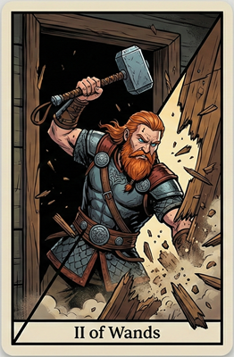

# 2 of Wands

**Key Word:**   
**Song:** [Break on Through (To the Other Side) by The Doors](https://www.youtube.com/watch?v=NFeUko-lQHg)  
**Hexagrams:** 43. Kuai / Break-through (Resoluteness)

### Upright

1) Focused on establishing a new pattern (direction forward).

### Reversed

1) 

### Card Description

The god Thor smashing through a wooden door, his hammer in hand (potentially with lightening emanating from it), pieces of the door are splintering and flying through the air all around him. The POV of the card is from the inside of the door, from a person standing immediately behind it, facing it directly. Thor is occupying the sinister base of the card, with his eyes aimed slightly down and to his left, intent on destroying whatever lays before him.

### Extra

[Life Finds a Way](https://www.youtube.com/watch?v=kiVVzxoPTtg)

### Footnotes

1. 

